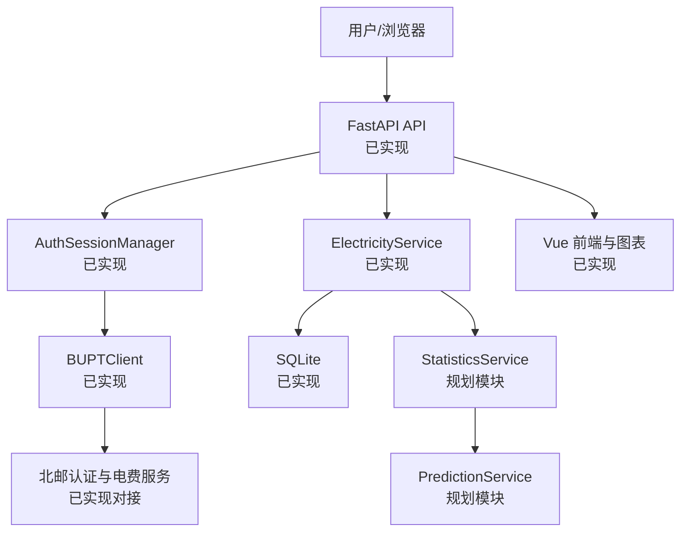
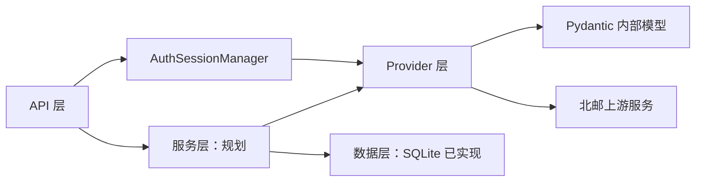
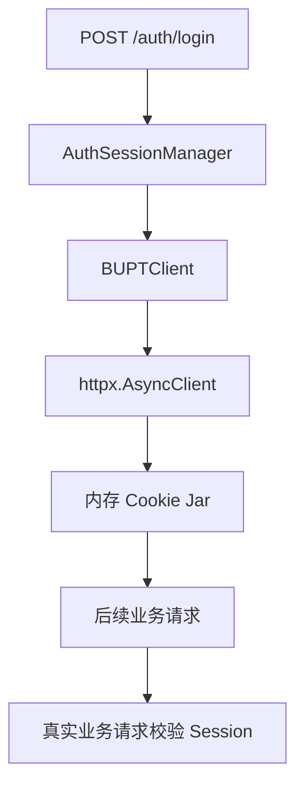

# 概要设计说明书

## 1 设计目标

系统采用分层和模块化设计：将北邮上游接口隔离在 Provider 层，将统一响应和内部数据模型作为稳定边界，并让后续数据存储、统计和展示可在不重写认证逻辑的前提下接入。

## 2 总体架构



当前 FastAPI 已提供认证路由和用于验证 Session 复用的 `/api/v1/electricity/buildings` 最小受保护路由；尚未提供完整的楼层、宿舍和电费查询 HTTP 路由。

## 3 模块划分

| 模块 | 职责 | 输入/输出 | 依赖 | 状态 |
|---|---|---|---|---|
| 认证模块 | CAS 登录、Cookie Jar 维护 | 凭据 → `AuthResult` | httpx、BeautifulSoup | 已实现并验证 |
| 数据采集模块 | 调用 `/part`、`/floor`、`/drom`、`/search` | 上游响应 → 内部模型 | BUPTClient、Pydantic | 已实现并验证 |
| 会话模块 | 管理唯一 client、登出和过期清理 | 认证状态 → `SessionStatus` | asyncio、BUPTClient | 已实现并验证 |
| API 模块 | 认证 API、受保护依赖注入 | HTTP → `ApiResponse` | FastAPI | 已实现并验证 |
| 业务服务模块 | 编排实时查询、去重和历史读取 | 标准模型 → 服务结果 | Provider、Repository | 已实现但尚未真实验证 |
| 数据存储模块 | 保存历史快照 | 读数 ↔ SQLite | SQLAlchemy、aiosqlite | 已实现但尚未真实验证 |
| 统计/预测模块 | 统计和预测 | 历史数据 → 指标/预测 | 数据存储 | 规划中，尚未实现 |
| 前端展示模块 | 登录、选择、概览与趋势 | FastAPI API → 页面 | Vue、ECharts | 已实现但尚未真实浏览器验收 |

## 4 模块依赖与分层原则



`partmentId`、`floorId`、`dromNum`、`surplus`、`freeEnd` 等上游字段由 `BUPTClient` 处理，不应无约束扩散到将来的服务、存储和前端层。内部模型包括 `Building`、`Floor`、`Room` 和 `ElectricityReading`。

## 5 认证架构



一次登录后，`AuthSessionManager` 持有一个 `BUPTClient`。登录、登出、状态检查和业务 client 租约由 `asyncio.Lock` 保护。Session 失效时 client 会关闭并移除；不保存旧密码，也不自动重登。

## 6 用户查询数据流

```mermaid
flowchart TD
    U[用户] --> A[统一认证]
    A --> C[BUPTClient]
    C --> B[选择校区]
    B --> P[/part 楼栋]
    P --> F[/floor 楼层]
    F --> R[/drom 宿舍]
    R --> S[/search 电费]
    S --> N[ElectricityReading 标准化]
    N --> DB[(历史数据库：SQLite)]
    DB --> ST[统计与预测：规划]
    ST --> FE[前端展示：规划]
```

## 7 异常处理

当前统一结果模型为 `ApiResponse[T]`，错误码包括：`OK`、`INVALID_ARGUMENT`、`AUTH_REQUIRED`、`AUTH_FAILED`、`SESSION_EXPIRED`、`NETWORK_ERROR`、`TIMEOUT`、`UPSTREAM_ERROR`、`PARSE_ERROR`、`NOT_FOUND`、`BUSINESS_ERROR`、`INTERNAL_ERROR`。Provider 将业务 `e != 0` 转换为 `BUSINESS_ERROR`，网络或 JSON/字段错误分别转为相应错误码。

## 8 后续扩展

SQLite 历史快照、统计分析、预测、提醒和前端均是规划模块。后续设计应继续复用当前内部模型和统一响应，不直接耦合学校上游字段。
