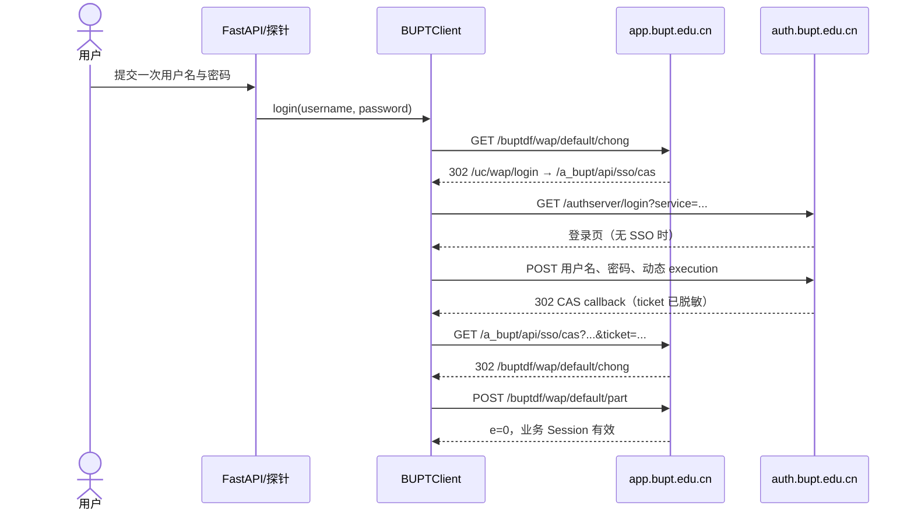
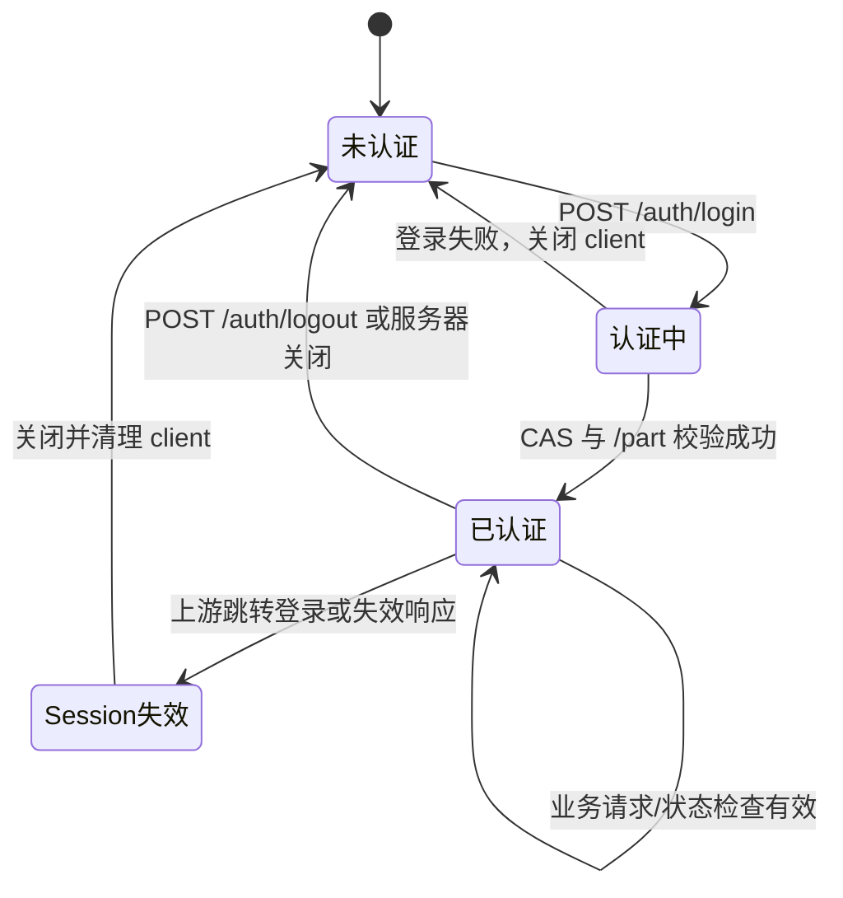
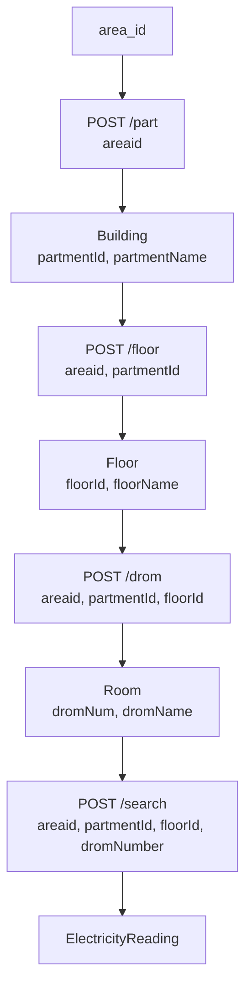

# 认证与数据采集模块设计说明书

本文件只描述当前已完成的底层模块。认证与数据采集链路已由开发阶段人工探针验证；不保存任何真实凭据或认证数据。

## 1 统一认证

电费入口为 `https://app.bupt.edu.cn/buptdf/wap/default/chong`。`BUPTAuthClient` 使用一个 `httpx.AsyncClient(follow_redirects=False)` 手动记录跳转；若认证端返回登录页，则用 BeautifulSoup 解析当前页面的动态 `execution`，再提交正常表单字段。不会伪造 CAS ticket 或硬编码 Cookie。

认证成功后，Cookie Jar 中已实际观察到 Cookie 名称 `UUkey` 与 `eai-sess`。文档不记录其值。

## 2 Session 生命周期

`AuthSessionManager` 仅有 `_client` 和异步锁，不保存用户名或密码。成功登录后保留的是 `BUPTClient` 内部的 `httpx.AsyncClient` 与内存 Cookie Jar。服务重启、logout 或 Session 失效均会关闭该 client；用户需要再次手动认证。

## 3 数据采集接口

| BUPTClient 方法 | 请求路径 | 表单参数 | 上游主要字段 | 内部输出 |
|---|---|---|---|---|
| `get_buildings` | `/buptdf/wap/default/part` | `areaid` | `partmentId`、`partmentName` | `Building(id, name, area_id)` |
| `get_floors` | `/buptdf/wap/default/floor` | `areaid`、`partmentId` | `floorId`、`floorName` | `Floor(id, name, building_id, area_id)` |
| `get_rooms` | `/buptdf/wap/default/drom` | `areaid`、`partmentId`、`floorId` | `dromNum`、`dromName` | `Room(id, name, floor_id, building_id, area_id)` |
| `query_electricity` | `/buptdf/wap/default/search` | `areaid`、`partmentId`、`floorId`、`dromNumber` | 见下表 | `ElectricityReading` |

接口拼写是 **`drom`**，不是 `dorm`。所有业务请求以 `application/x-www-form-urlencoded` 方式发送。

## 4 ID 映射

`partmentName` 是显示名称，`partmentId` 是楼栋内部 ID；`floorName` 对应 `floorId`；`dromName` 对应 `dromNum`。`/search` 的 `dromNumber` 必须使用 `dromNum`。系统不建立静态宿舍名称到 ID 的映射表，所有 ID 均由上游级联接口动态获得。

## 5 电费字段标准化

`ElectricityReading` 保存定位字段、`source_time`、可选的金额/电量字段、`price_per_kwh` 与完整 `raw_data`。保留原始数据是因为部分上游字段（例如 `vTotal`）的业务含义尚未在当前代码中解释，且接口字段可能变化。

| 校区判定 | 上游字段 | 当前映射 |
|---|---|---|
| `area_id == "1"`（西土城） | `surplus` | `remaining_energy_kwh` |
| `area_id == "1"`（西土城） | `freeEnd` | `free_remaining_kwh` |
| `area_id != "1"`（含沙河） | `surplus` | `remaining_money` |
| `area_id != "1"`（含沙河） | `price > 0`、`surplus` | `remaining_kwh = surplus / price` |
| `area_id != "1"`（含沙河） | `freeEnd` | `total_usage_kwh` |
| 全部 | `price`、`time`、`parName`、`floorName` | `price_per_kwh`、`source_time`、楼栋/楼层名称 |

空字符串或非法数值会安全转换为 `None`；不会猜测其数值含义。

## 6 安全设计

- CLI 探针使用 `getpass` 输入密码；FastAPI 的 `LoginRequest.password` 使用 `SecretStr`。
- 账号密码仅用于当前认证调用，不写入日志、配置、数据库或管理器属性。
- 跳转日志会移除 `ticket`、`execution`、密码、用户名、token 与 authorization 查询参数。
- Cookie 仅留在内存；不生成 Cookie 文件、Session 文件或序列化对象。
- 使用学校正常 CAS 认证流程，不生成 ticket、不绕过验证码，也不进行自动批量扫描。
