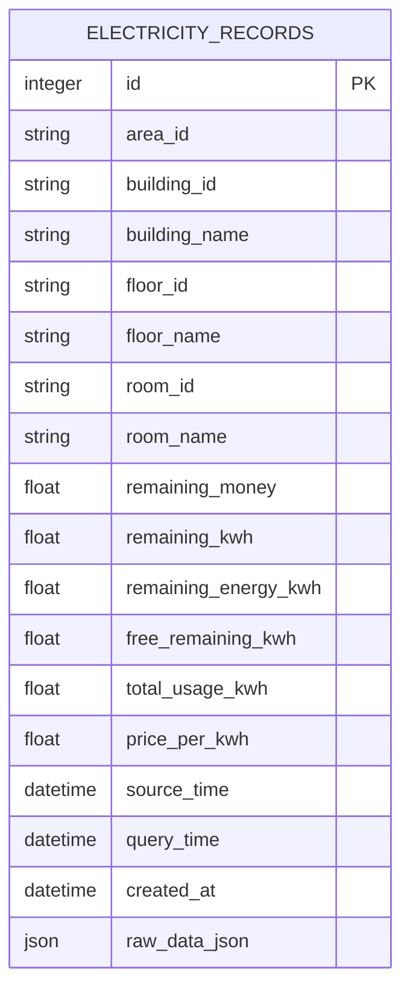
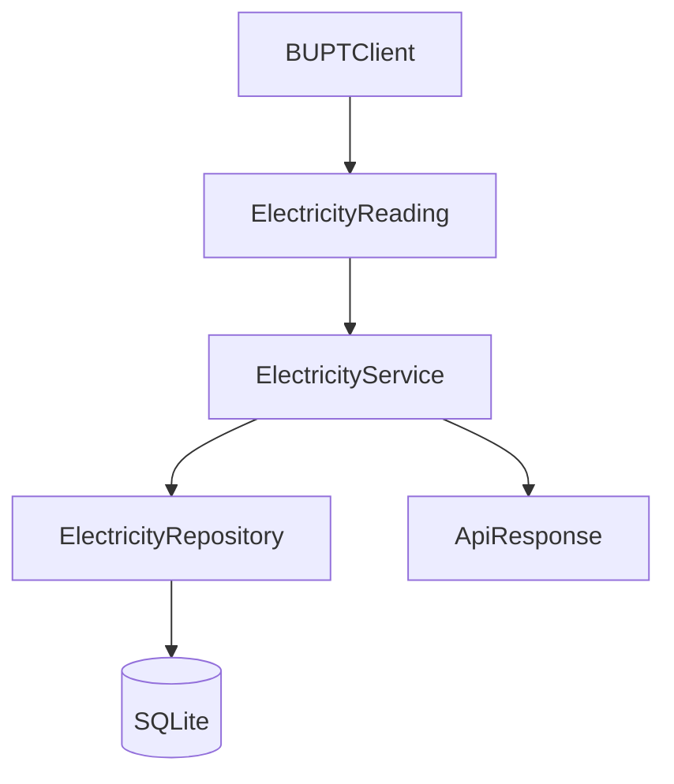

# 数据需求与数据库设计

## 1 范围与状态

本设计对应当前实现的 SQLite 历史快照功能。ORM、Repository、Service 和 API 已实现且有临时数据库测试；真实上游 `database_probe.py` 验证尚未完成。

数据库角色是**历史快照存储**，不是学校接口缓存。用户发起实时查询时仍会调用 `BUPTClient.query_electricity()`，随后尝试保存新的上游快照。

## 2 数据模型

表名为 `electricity_records`，主键 `id` 为自增整数。`area_id`、`building_id`、`floor_id`、`room_id` 均保存学校内部 ID；名称字段保存当次快照的可读名称，以避免后续上游名称变化影响历史解释。

| 字段 | NULL | 含义 |
|---|---:|---|
| `remaining_money` | 是 | 当前标准模型中的剩余金额（元） |
| `remaining_kwh` | 是 | 当前标准模型的可估算剩余电量 |
| `remaining_energy_kwh` | 是 | 西土城语义下的剩余电量 |
| `free_remaining_kwh` | 是 | 西土城语义下的赠送剩余电量 |
| `total_usage_kwh` | 是 | 非西土城语义下的累计用电量 |
| `price_per_kwh` | 是 | 上游电价 |
| `source_time` | 是 | 上游电控系统的业务时间 |
| `query_time` | 否 | 本程序查询时间 |
| `created_at` | 否 | 插入时间；当前与 `query_time` 一致 |
| `raw_data_json` | 否 | `ElectricityReading.raw_data` 的业务原始字段 |

## 3 快照与去重策略

`electricity_records` 是追加式历史表，不更新旧记录。有效 `source_time` 使用唯一约束：`(area_id, room_id, source_time)`。Service 会先显式查询，再插入；如并发竞争触发唯一约束，回滚并将其视为成功的重复快照。

若 `source_time` 缺失或无法按 ISO 风格时间解析，保存 `NULL`，跳过去重检查并插入新快照。SQLite 对唯一约束中的 `NULL` 不视为相同值，符合“不能把缺失时间误判重复”的要求。

## 4 时间策略

上游 `source_time` 解析为 `datetime`。当前工程以 `Asia/Shanghai` 为本地业务时区，并以**无时区 naive datetime**存入 SQLite：无时区上游时间按本地时间解释；有时区输入会先转换为北京时间再去除 tzinfo。`query_time` 和 `created_at` 也采用同一策略，避免混用 aware 与 naive 时间。

历史默认按 `coalesce(source_time, query_time)` 升序返回。指定 `limit` 时返回最近 N 条，但结果仍按升序排列，便于后续曲线展示。

## 5 分层与事务

Repository 只执行 `add`、`get_by_source_time`、`get_history`、`get_latest`，不提交事务。`ElectricityService` 拥有 transaction boundary：插入后 `commit`，发生 `IntegrityError` 或 `SQLAlchemyError` 时 `rollback`。历史和 latest 读取只访问 SQLite，不要求当前北邮 Session；实时 query 路由才使用认证 dependency。

## 6 数据安全与生命周期

数据库路径是 `data/electricity.db`，目录会自动创建。`.gitignore` 忽略 `data/*.db`、`*.sqlite` 与 `*.sqlite3`。ORM 中没有 username、password、Cookie、CAS ticket、execution 或 Authorization 字段；`raw_data_json` 仅保存电费查询的业务数据。

当前不设计自动清理策略，历史记录保留用于后续统计。数据量和保留周期策略待有实际使用数据后再确定。
