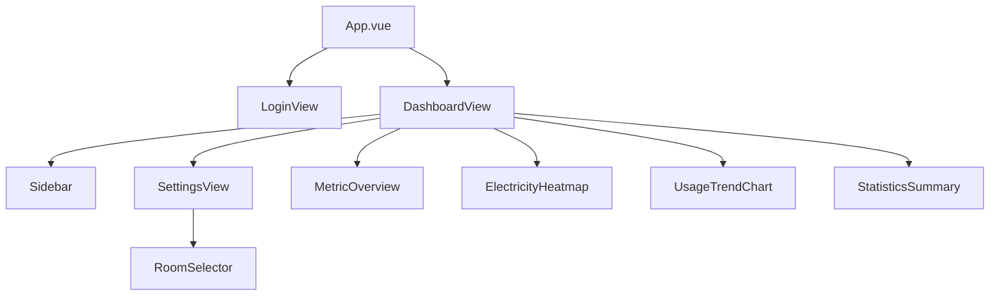

# 前端设计说明

## 1 范围与状态

`frontend/` 使用 Vue 3、Vite、TypeScript、ECharts 和 Lucide 图标构建桌面优先的单用户 Dashboard。生产构建已通过；真实浏览器中与已登录北邮 Session 的完整级联操作尚待人工验收。

前端不保存密码、Cookie、CAS ticket 或 `execution`。登录密码只存在于表单提交期间；成功或失败后均清空输入框。

## 2 页面与组件

`LoginView` 完成统一认证 API 调用；`RoomSelector` 位于设置页，按校区、楼栋、楼层、宿舍顺序级联请求，切换上级时清空下级。保存后仅将非敏感的宿舍 ID 与显示名称保存到浏览器 localStorage，并自动返回面板刷新真实读数。概览页展示当前余额、累计用电量和数据时间；趋势图使用 SQLite 历史记录。

## 3 API 依赖

| 前端能力 | 后端 API | 数据状态 |
|---|---|---|
| 登录、状态、退出 | `/api/v1/auth/login`、`/status`、`/logout` | 已接入 |
| 校区后的楼栋 | `GET /api/v1/electricity/buildings` | 已接入 |
| 楼层、宿舍 | `GET /api/v1/electricity/floors`、`/rooms` | 本阶段新增并接入 |
| 实时查询与保存 | `POST /api/v1/electricity/query` | 已接入 |
| 历史与最新记录 | `GET /history/{room_id}`、`/latest/{room_id}` | 历史已接入；latest 预留 |

`/floors` 和 `/rooms` 是为四级前端选择新增的最小薄路由，仅代理现有已认证 `BUPTClient` 方法，未改动 Provider、认证或数据库核心。

## 4 视觉系统

界面使用浅中性背景、白色内容面、淡边界线和克制圆角。侧栏只保留“设置”和“AstrBot 接入”；AstrBot 后端 API 尚不存在，因此显示明确占位说明。页面以统一指标区域、分隔线和留白建立层级，不采用多张厚重悬浮卡片、霓虹渐变或大面积阴影。

Design Tokens 定义在 `frontend/src/assets/main.css`，包括背景、文字、边界、绿色强调色、警告/错误语义色、圆角与间距。绿色只用于连接正常、趋势线和少量强调元素。

## 5 Heatmap、图表与状态

- 每日耗电 Heatmap 是固定 13 周宽度的最近 90 天网格；每格为 `20px`、间隙 `4px`，网格在卡片内居中，月份标签每月只出现一次。当前没有可靠的每日统计 API，因此正常模式显示无数据灰格和“正在积累每日用电数据”。
- 统计摘要（今日、3 日、7 日、预计可用）均显示“数据积累中”，不将 null 转为 0，也不在前端猜测统计值。
- ECharts 分别展示累计用电和余额趋势，避免不同单位的双 Y 轴混图。历史点不足两条时显示空状态。
- 所有级联和查询失败在相应区域显示 inline error；无 `alert()`。

### 演示模式

前端开发时可在地址后添加 `?demo=1`，例如 `http://localhost:5173/?demo=1`。该模式不发起认证或业务 API 请求，提供内存中的 90 天示例读数、每日耗电和趋势数据，并在页头及 Heatmap 中标明“演示数据”。它不读取或写入 SQLite、localStorage 中的认证信息，也不会混入正常运行结果；移除查询参数即可回到真实模式。

## 6 启动与验证

后端：`python -m uvicorn app.main:app --reload`。前端：在 `frontend/` 运行 `npm run dev`，Vite 将 `/api` 代理到 `127.0.0.1:8000`。以 `?demo=1` 可不依赖后端验证紧凑 Dashboard、Heatmap 尺寸、趋势图和窗口缩放。已验证 `npm run build` 成功；后续人工验收应覆盖登录、四级选择、真实读数、历史空态/趋势、窗口缩放和 ECharts resize。

## 7 尚未实现

StatisticsService、自然日耗电算法、充值事件、低电量预警、预测、完整每日 Heatmap 数据、事件 API 与正式移动端布局均尚未实现。正常模式不伪造业务数据；仅 `?demo=1` 为前端验收提供可识别的内存样例。
