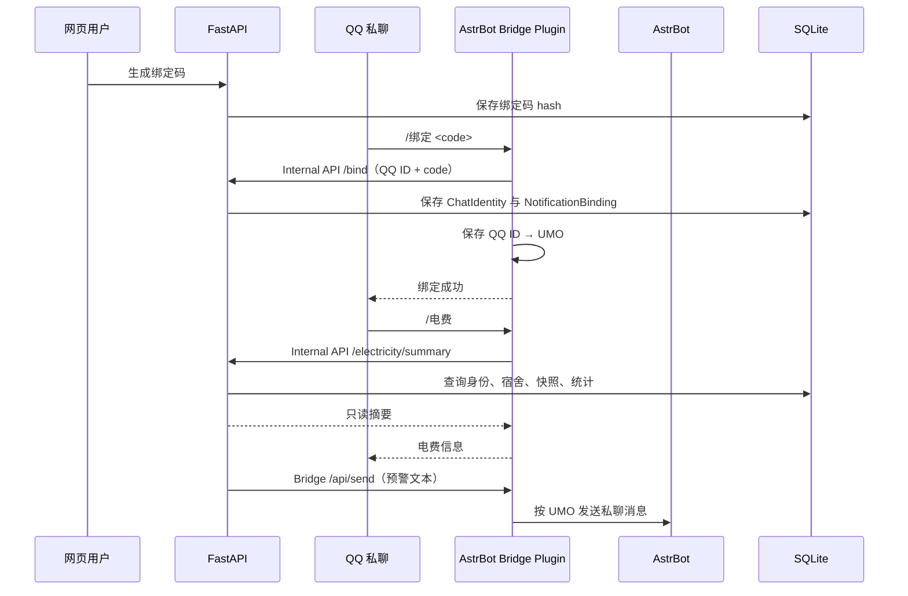

# AstrBot 与 QQ 时序图

```mermaid
sequenceDiagram
    participant W as 网页用户
    participant F as FastAPI
    participant Q as QQ 私聊
    participant P as AstrBot Bridge Plugin
    participant A as AstrBot
    participant D as SQLite

    W->>F: 生成绑定码
    F->>D: 保存绑定码 hash
    Q->>P: /绑定 <code>
    P->>F: Internal API /bind（QQ ID + code）
    F->>D: 保存 ChatIdentity 与 NotificationBinding
    P->>P: 保存 QQ ID → UMO
    P-->>Q: 绑定成功

    Q->>P: /电费
    P->>F: Internal API /electricity/summary
    F->>D: 查询身份、宿舍、快照、统计
    F-->>P: 只读摘要
    P-->>Q: 电费信息

    F->>P: Bridge /api/send（预警文本）
    P->>A: 按 UMO 发送私聊消息
```

FastAPI 不构造、不保存、不读取 AstrBot UMO。

