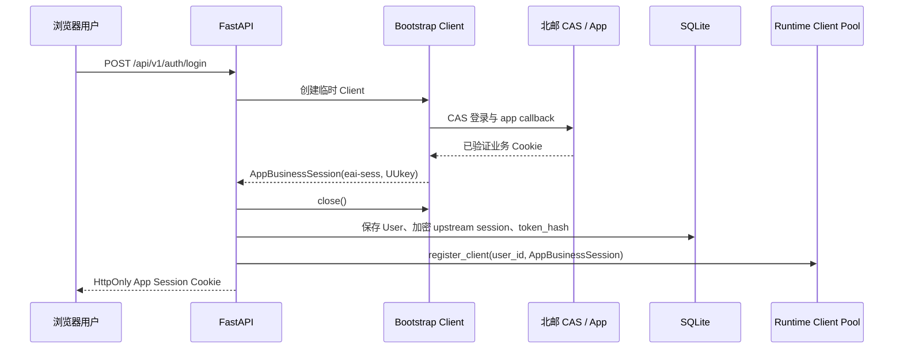

# 认证时序图

```mermaid
sequenceDiagram
    participant U as 浏览器用户
    participant A as FastAPI
    participant B as Bootstrap Client
    participant C as 北邮 CAS / App
    participant D as SQLite
    participant R as Runtime Client Pool

    U->>A: POST /api/v1/auth/login
    A->>B: 创建临时 Client
    B->>C: CAS 登录与 app callback
    C-->>B: 已验证业务 Cookie
    B-->>A: AppBusinessSession(eai-sess, UUkey)
    A->>B: close()
    A->>D: 保存 User、加密 upstream session、token_hash
    A->>R: register_client(user_id, AppBusinessSession)
    A-->>U: HttpOnly App Session Cookie
```

Bootstrap Client 不进入 Runtime Pool；CAS Cookie、ticket、密码与 execution 均不持久化。

