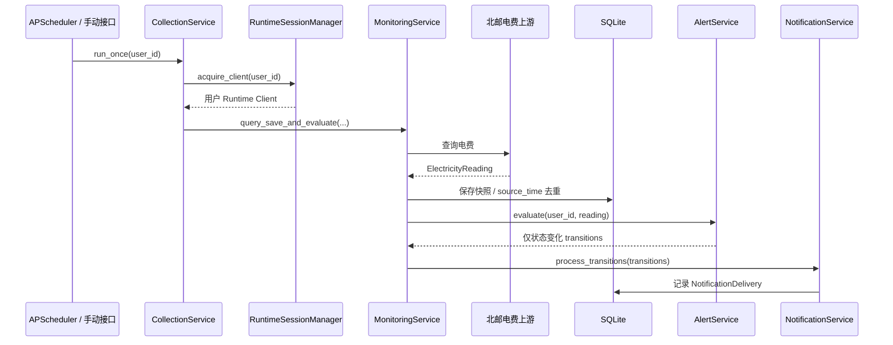

# 采集与预警时序图

```mermaid
sequenceDiagram
    participant S as APScheduler / 手动接口
    participant C as CollectionService
    participant R as RuntimeSessionManager
    participant M as MonitoringService
    participant B as 北邮电费上游
    participant D as SQLite
    participant A as AlertService
    participant N as NotificationService

    S->>C: run_once(user_id)
    C->>R: acquire_client(user_id)
    R-->>C: 用户 Runtime Client
    C->>M: query_save_and_evaluate(...)
    M->>B: 查询电费
    B-->>M: ElectricityReading
    M->>D: 保存快照 / source_time 去重
    M->>A: evaluate(user_id, reading)
    A-->>M: 仅状态变化 transitions
    M->>N: process_transitions(transitions)
    N->>D: 记录 NotificationDelivery
```

Scheduler 只调用 CollectionService；不直接处理 Alert 或通知。通知失败不会影响已经保存的快照或 Alert 状态。

