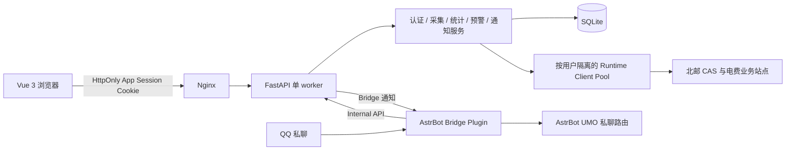

# 系统架构图

```mermaid
flowchart LR
    Browser[Vue 3 浏览器] -->|HttpOnly App Session Cookie| Nginx[Nginx]
    Nginx --> API[FastAPI 单 worker]
    API --> Services[认证 / 采集 / 统计 / 预警 / 通知服务]
    Services --> DB[(SQLite)]
    Services --> Runtime[按用户隔离的 Runtime Client Pool]
    Runtime --> BUPT[北邮 CAS 与电费业务站点]
    API -->|Bridge 通知| Plugin[AstrBot Bridge Plugin]
    QQ[QQ 私聊] --> Plugin
    Plugin -->|Internal API| API
    Plugin --> UMO[AstrBot UMO 私聊路由]
```

## 边界说明

- Nginx 处理外部 HTTP(S) 与 FastAPI 反向代理。
- FastAPI 仅持有 QQ ID；UMO 保留在 AstrBot 插件侧。
- SQLite 存放应用数据与真实快照；演示 JSON 不写入 SQLite。
- FastAPI 进程内 Scheduler 需要单 worker 运行。

